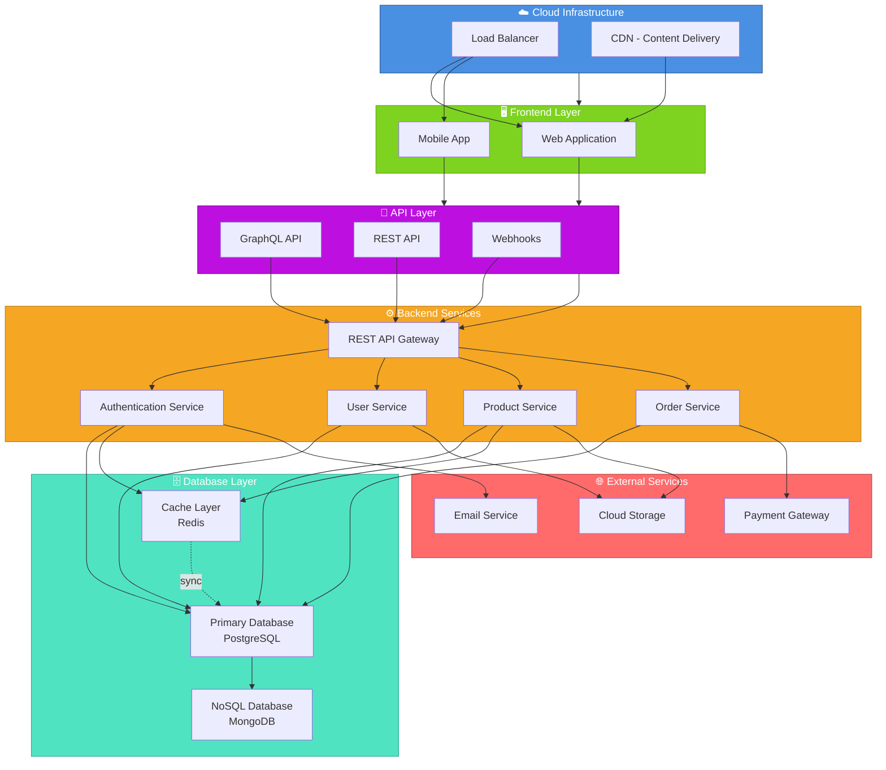

# Eagles ULTD - System Architecture Overview

This document provides a comprehensive overview of the Eagles ULTD system architecture, including cloud infrastructure, API layers, backend services, and frontend application.

## Architecture Diagram

## Architecture Components

### 1. Cloud Infrastructure ☁️
- **Load Balancer**: Distributes incoming traffic across multiple servers
- **CDN (Content Delivery Network)**: Optimizes content delivery globally with caching at edge locations

### 2. Frontend Layer 🖥️
- **Web Application**: Browser-based interface for desktop users
- **Mobile App**: Native or cross-platform mobile application

### 3. API Layer 🔌
- **GraphQL API**: Flexible query language for efficient data fetching
- **REST API**: Traditional RESTful endpoints for standard operations
- **Webhooks**: Event-driven communication for real-time updates

### 4. Backend Services ⚙️
- **API Gateway**: Single entry point that routes requests to appropriate services
- **Authentication Service**: Manages user authentication and security
- **User Service**: Handles user profiles and account management
- **Product Service**: Manages product catalog and inventory
- **Order Service**: Processes orders and transactions

### 5. Database Layer 🗄️
- **Primary Database (PostgreSQL)**: Relational database for structured data
- **Cache Layer (Redis)**: In-memory caching for performance optimization
- **NoSQL Database (MongoDB)**: Document-oriented storage for flexible schemas

### 6. External Services 🌐
- **Payment Gateway**: Secure payment processing
- **Email Service**: Transactional and marketing emails
- **Cloud Storage**: File and media storage (S3-compatible)

## Data Flow

1. **User Request** → Load Balancer distributes traffic
2. **API Request** → API Layer (GraphQL/REST/Webhooks)
3. **Processing** → Backend services process request
4. **Data Access** → Database layer (Primary/Cache/NoSQL)
5. **External Integration** → Third-party services as needed
6. **Response** → Back through API to Frontend

## Scalability & Reliability

- **Horizontal Scaling**: Multiple instances of backend services
- **Caching Strategy**: Redis for frequently accessed data
- **CDN Distribution**: Global content delivery
- **Database Replication**: Primary-replica setup for reliability
- **Load Balancing**: Even distribution of requests

## Security Features

- Centralized authentication service
- API Gateway validation and rate limiting
- Secure communication (HTTPS/TLS)
- Database encryption at rest and in transit
- Webhook signature verification

---

*Last Updated: 2026-05-24*
*Organization: Eagles ULTD*
